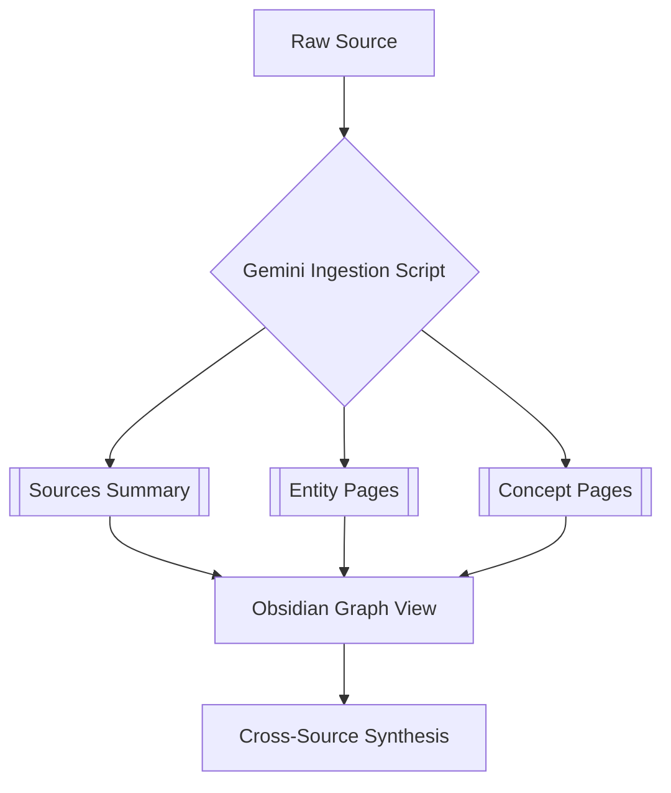

# memex — Poovi's Second Brain

[](https://opensource.org/licenses/MIT)
[](https://deepmind.google/technologies/gemini/)
[](https://karpathy.ai/)

A high-performance personal knowledge base maintained by a Gemini CLI agent, built on Andrej Karpathy's **LLM Wiki pattern**. This system transforms fragmented raw information into a structured, interlinked, and queryable "Second Brain" designed for long-term knowledge synthesis.

---

## 🧠 Why the LLM Wiki Pattern?

Traditional RAG (Retrieval-Augmented Generation) systems suffer from "context amnesia" and often fail to capture the deep, interlinked nature of complex domains. **memex** follows the LLM Wiki pattern where:

1.  **The LLM is the Librarian**: An agent actively ingests, classifies, and interlinks information.
2.  **Declarative Memory**: Knowledge is stored as structured Markdown files (Entities, Concepts, Sources) that serve as a persistent "memory" for both humans and AI agents.
3.  **Synthesis-First**: Unlike simple search, this system prioritises cross-source reasoning and the resolution of contradictions.

---

## 🏛️ Architecture

The system is built on a **Three-Layer Architecture**:

-   **Layer 1: Raw (Immutable Source)** — Web clips, PDFs, transcripts, and YouTube records. Never modified, serves as the ground truth.
-   **Layer 2: Wiki (Agent-Maintained)** — A structured network of interlinked Markdown files. This is the "living" knowledge layer.
-   **Layer 3: Analysis & Synthesis** — Automated tools for health checks (Linting) and cross-domain synthesis.

### **The Ingestion Pipeline**
The pipeline leverages **Gemini 2.5's 1M+ context window** to perform one-shot analysis of long-form content.



---

## 🛠️ Tech Stack

-   **Runtime**: Gemini CLI & Python 3.12
-   **LLMs**: Gemini 2.5 Pro (Synthesis), Gemini 2.5 Flash (Ingestion/Linting)
-   **Storage**: Local Markdown Files
-   **Interface**: [Obsidian](https://obsidian.md/)
-   **Automation**: Custom Python suite (`ingest.py`, `lint.py`, `synthesise.py`)
-   **Infrastructure**: Proxmox VE Homelab integration via [[OpenClaw]]

---

## 🚀 Getting Started

### **Prerequisites**
-   Python 3.10+
-   A Google Gemini API Key (set in `.env`)
-   Obsidian (to browse the wiki)

### **Installation**
1.  Clone the repository.
2.  Install dependencies:
    ```bash
    pip install -r requirements.txt
    ```
3.  Configure your environment:
    ```bash
    cp .env.example .env
    # Add your GEMINI_API_KEY
    ```

### **Usage**
-   **Ingest new sources**: `python scripts/ingest.py raw/articles/`
-   **Health check**: `python scripts/lint.py`
-   **Create a synthesis**: `python scripts/synthesise.py "AI agent design patterns"`

---

## 👤 About the Curator

**Poovannan Rajendran (Poovi)** is a rare hybrid: a Senior Account Manager at **Verisk** with 20+ years of depth in the **Lloyd's of London** insurance market, combined with the technical capability to ship production AI systems. 

This memex serves as his primary research hub for:
-   **Lloyd's Market Intelligence**
-   **AI Engineering & Agentic Workflows**
-   **Mahabharata Moments Podcast**

---

## 📜 License

MIT © 2026 Poovannan Rajendran.
