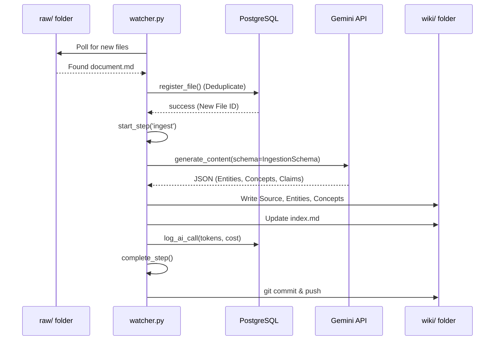

# memex — Architecture & Tools

## 1. Architectural Principles: The Three-Layer Stack
The memex is built on a decoupled, three-layer architecture to ensure that the source of truth (Raw) is never compromised, while the interpretation of that truth (Wiki) can evolve through agent-driven synthesis.

```mermaid
graph TD
    subgraph "Layer 1: Raw (Ground Truth)"
        A1[Articles / HTML]
        A2[PDFs / Papers]
        A3[YouTube / JSON]
        A4[Transcripts / TXT]
    end

    subgraph "Layer 2: Wiki (Declarative Memory)"
        B1[[Sources]]
        B2[[Entities]]
        B3[[Concepts]]
        B4[[Synthesis]]
        B1 <--> B2
        B2 <--> B3
        B3 <--> B4
    end

    subgraph "Layer 3: Analysis (Automation Engine)"
        C1[ingest.py]
        C2[lint.py]
        C3[synthesise.py]
        C4[watcher.py]
    end

    subgraph "Infrastructure & UI"
        D1[PostgreSQL]
        D2[Obsidian]
        D3[Git / GitHub]
    end

    Layer 1 --> C1
    C1 --> Layer 2
    C2 --> Layer 2
    C3 --> Layer 2
    Layer 3 --> D1
    Layer 2 --- D2
    Layer 3 --> D3
```

### Layer Descriptions
- **Layer 1: Raw**: Immutable storage. Every piece of knowledge begins here.
- **Layer 2: Wiki**: A structured graph of Markdown files. This layer is the "Brain."
- **Layer 3: Analysis**: The automation engine that processes Layer 1 into Layer 2 and maintains health through Layer 3.

## 2. Tool Evaluation & Selection

| Tool / Technology | Evaluation | Final Selection |
| :--- | :--- | :--- |
| **Model Ecosystem** | OpenAI vs. Google | **Google Gemini 2.5 Pro/Flash**: The 1M+ context window makes cross-source reasoning possible without complex chunking. |
| **Storage Engine** | Vector DB vs. Markdown | **Local Markdown (Obsidian)**: Human-readable, Git-trackable, and provides the best graph visualisation via wikilinks. |
| **Logging** | Flat Files vs. SQL | **PostgreSQL**: Required for granular token tracking, cost auditing, and file deduplication at scale. |
| **Runtime** | Node.js vs. Python | **Python 3.12**: superior library support for AI SDKs (google-genai, pydantic) and data processing. |
| **Trigger Mechanism** | Polling vs. Webhooks | **Hybrid**: `watcher.py` (Polling) for local ease; `runner_api.py` (FastAPI) for remote triggers (OpenClaw). |

## 3. The Ingestion Flow (Sequencing)
The "Research Librarian" workflow is a strictly sequenced process to ensure data integrity and cost transparency.



## 4. Cost Optimization Architecture
Synthesis is the most expensive operation. We use a **Tiered Context Strategy**:

1.  **Index Filtering**: Instead of reading all files, we query a lightweight `wiki_index.json`.
2.  **Claim Extraction**: We use the cheaper **Flash-Lite** model to extract 3-5 key claims per page before the main synthesis.
3.  **Synthesis Mode**:
    *   **Flex**: Immediate, higher cost.
    *   **Batch**: 24h delivery, 50% discount.
